# Pipeline for RNA-seq Analysis

## Using STAR
### STEP 0: Merge FASTQ
<pre><code>
#!/bin/bash
#$ -N merged_fastq
#$ -q epyc,bio
#$ -pe openmp 8
#$ -R y
#$ -t 1-20


prefix=`head -n $SGE_TASK_ID fastq.prefixes.txt | tail -n 1`

cat ${prefix}_L001_R1_001.fastq ${prefix}_L002_R1_001.fastq ${prefix}_L003_R1_001.fastq ${prefix}_L004_R1_001.fastq > ${prefix}_R1.fastq

cat ${prefix}_L001_R2_001.fastq ${prefix}_L002_R2_001.fastq ${prefix}_L003_R2_001.fastq ${prefix}_L004_R2_001.fastq > ${prefix}_R2.fastq
</code></pre>

### STEP 1: FASTQC (Raw FASTQ)
<pre><code>#!/bin/bash
#$ -N fastqc_bef
#$ -q epyc,bio
#$ -pe openmp 8
#$ -R y
#$ -t 1-12

module load fastqc

prefix=`head -n $SGE_TASK_ID fastq.prefixes.txt | tail -n 1` # {ls *1.fastq.gz | sed 's/_R1.fastq.gz//' > fastq.prefixes.txt}

gunzip ${prefix}*
fastqc -t 64 -o ./fastqc_bef --noextract ${prefix}_R1.fastq ${prefix}_R2.fastq #mkdir fastqc_bef
</code></pre>

### STEP 2: rRNA Removal
<pre><code>#!/bin/bash
#$ -N rRNA_removal
#$ -q epyc,bio
#$ -pe openmp 8
#$ -R y
#$ -t 1-12

prefix=`head -n $SGE_TASK_ID fastq.prefixes.txt | tail -n 1`

./sortmerna-2.1b/scripts/merge-paired-reads.sh ${prefix}_R1.fastq ${prefix}_R2.fastq ${prefix}-interleaved.fastq

cd ./sortmerna-2.1b

time ./sortmerna --ref ./rRNA_databases/silva-bac-16s-id90.fasta,./index/silva-bac-16s-db:./rRNA_databases/silva-bac-23s-id98.fasta,./index/silva-bac-23s-db:./rRNA_databases/silva-arc-16s-id95.fasta,./index/silva-arc-16s-db:./rRNA_databases/silva-arc-23s-id98.fasta,./index/silva-arc-23s-db:./rRNA_databases/silva-euk-18s-id95.fasta,./index/silva-euk-18s-db:./rRNA_databases/silva-euk-28s-id98.fasta,./index/silva-euk-28s:./rRNA_databases/rfam-5s-database-id98.fasta,./index/rfam-5s-db:./rRNA_databases/rfam-5.8s-database-id98.fasta,./index/rfam-5.8s-db --reads ../${prefix}-interleaved.fastq --paired_in --fastx --other ../${prefix}-sortmerna --log sample.${prefix}.log -a8 -v --aligned ../${prefix}-rRNA 
 
cd ..

./sortmerna-2.1b/scripts/unmerge-paired-reads.sh ${prefix}-sortmerna.fastq ${prefix}-sortmerna_1.fastq ${prefix}-sortmerna_2.fastq
</code></pre>

### STEP 3 : Trim Adapters (Over Represented Sequences)
<pre><code>#!/bin/bash
#$ -N adapter_trimming
#$ -q epyc,bio
#$ -pe openmp 8
#$ -R y
#$ -t 1-12

module load trimmomatic
module load BBMap

prefix=`head -n $SGE_TASK_ID fastq.prefixes.txt | tail -n 1`

bbmerge.sh in1=${prefix}_R1.fastq in2=${prefix}_R2.fastq outa=${prefix}_adapters.fa

java -jar /data/apps/trimmomatic/0.35/trimmomatic-0.35.jar PE -threads 8 -phred33 ${prefix}-sortmerna_1.fastq ${prefix}-sortmerna_2.fastq ${prefix}-sortmerna-trimmomatic_1.fq ${prefix}-sortmerna-unpaired_1.fq ${prefix}-sortmerna-trimmomatic_2.fq ${prefix}-sortmerna-unpaired_2.fq ILLUMINACLIP:"${prefix}_adapters.fa":2:30:10 SLIDINGWINDOW:5:20 MINLEN:22
</code></pre>

### STEP 4: FASTQC (Processed FASTQ)
<pre><code>#!/bin/bash
#$ -N fastqc_aft
#$ -q epyc,bio
#$ -pe openmp 8
#$ -R y
#$ -t 1-12

module load fastqc

prefix=`head -n $SGE_TASK_ID fastq.prefixes.txt |tail -n 1`

fastqc -t 8 -o ./fastqc_aft --noextract ${prefix}-sortmerna-trimmomatic_1.fq ${prefix}-sortmerna-trimmomatic_2.fq #mkdir fastqc_aft
</code></pre>

### STEP 5a : STAR Alignment (Genome Generation)
<pre><code>#!/bin/bash
#$ -N star_genome_generation
#$ -q epyc,bio
#$ -pe openmp 8

module load STAR/2.5.2a

STAR --runMode genomeGenerate --genomeDir ../star_genome/indices/genome --genomeFastaFiles ../star_genome/genome.fa --runThreadN 8 --sjdbOverhang 99 --sjdbGTFfile ../star_genome/genome.gff3 
</code></pre>

### STEP 5b : STAR Alignment (Alignment)
<pre><code>#!/bin/bash
#$ -N star_jobs
#$ -q epyc,bio
#$ -pe openmp 8
#$ -R y
#$ -t 1-12

module load STAR/2.5.2a

prefix=`head -n $SGE_TASK_ID fastq.prefixes.txt | tail -n 1`

STAR --genomeDir ../star_genome --readFilesIn ../fastq_files/${prefix}-sortmerna-trimmomatic_1.fq ../fastq_files/${prefix}-sortmerna-trimmomatic_2.fq --runThreadN 24 --outFileNamePrefix ${prefix}-STAR  --outSAMtype BAM Unsorted SortedByCoordinate
</code></pre>

### STEP 6 : Feacture Count generation
> The R script for the feture count matrix is as follows:
<pre><code>library(Rsubread)
bamLocal <- getwd()
bamFiles <- list.files(bamLocal,pattern="*Aligned.sortedByCoord.out.bam")
fc <- featureCounts(bamFiles, nthreads = 8, annot.inbuilt = "mm10", isPairedEnd = T, strandSpecific = 0)
</code></pre>

## Using HISAT2

### STEP 1: FASTQC (Raw FASTQ)
<pre><code>#!/bin/bash
#$ -N fastqc_bef
#$ -q epyc,bio
#$ -pe openmp 8
#$ -R y
#$ -t 1-12

module load fastqc

prefix=`head -n $SGE_TASK_ID fastq.prefixes.txt | tail -n 1` # {ls *1.fq.gz | sed 's/_R1.fq.gz//' > fastq.prefixes.txt}

fastqc -t 64 -o ./fastqc_bef --noextract ${prefix}_R1.fastq ${prefix}_R2.fastq #mkdir fastqc_bef
</code></pre>

### STEP 2a : HISAT Alignment (Genome Index)
<pre><code>#!/bin/bash
#$ -N hisat_genome_index
#$ -q epyc,bio
#$ -pe openmp 8

module load hisat2/2.1.0
module load python/2.7.15

hisat2_extract_splice_sites.py -v ./referenceData/annotations/Mus_musculus.GRCm38.80.gtf > ./referenceData/hisat2_index/splice_sites.txt

hisat2_extract_exons.py -v ./referenceData/annotations/Mus_musculus.GRCm38.80.gtf > ./referenceData/hisat2_index/exons.txt

hisat2-build ./referenceData/fasta/Mus_musculus.GRCm38.dna_sm.primary_assembly.fa --ss ./referenceData/hisat2_index/splice_sites.txt --exon ./referenceData/hisat2_index/exons.txt ./referenceData/hisat2_index/GRCm38.hisat2
</code></pre>

### STEP 2b : HISAT2 Alignment (Alignment)
<pre><code>#!/bin/bash
#$ -N hisat_jobs
#$ -q epyc,bio
#$ -pe openmp 8
#$ -R y
#$ -t 1-12

module load hisat2/2.1.0
module load python/2.7.15
module load samtools/1.9

prefix=`head -n $SGE_TASK_ID fastq.prefixes.txt | tail -n 1`

hisat2 -x ${hisat2Ref} -U ${prefix}_R1.fastq -U ${prefix}_R2.fastq | samtools view -bh - | samtools sort - > ${prefix}.bam

samtools index ${prefix}.bam
</code></pre>

### STEP 3 : Feacture Count generation
> The R script for the feture count matrix is as follows:
<pre><code>library(Rsubread)
bamLocal <- getwd()
bamFiles <- list.files(bamLocal,pattern="*.bam$")
fc <- featureCounts(bamFiles, nthreads = 8, annot.inbuilt = "mm10", isPairedEnd = T, strandSpecific = 0)
</code></pre>

## R SCRIPT for both Pipelines
<pre><code>```{r setup, include=FALSE}
knitr::opts_chunk$set(echo = TRUE)
library("DESeq2")
library("vsn")
library("pheatmap")
library("ggplot2")
library("RColorBrewer")
```


# Loading data

```{r load_data}
load("fc_JoshR6_hisat.RData") #fc1
load("fc_JoshR6_star.RData")  #fc
targets <- read.csv("Targets.csv")
colnames(fc$counts) <- targets$Name
colnames(fc1$counts) <- targets$Name
group <- factor(targets$Group, levels = c("Con_Plx","Con_Veh","R6_Plx","R6_Veh"))
```

## Matrix formation

```{r deseq2}
dds1 <- DESeqDataSetFromMatrix(countData = fc$counts,
                              colData = targets,
                              design= ~ 0+Group)
keep <- rowSums(counts(dds1)) >= 10
dds1 <- dds1[keep,]

dds2 <- DESeqDataSetFromMatrix(countData = fc1$counts,
                              colData = targets,
                              design= ~ 0+Group)
keep <- rowSums(counts(dds2)) >= 10
dds2<- dds2[keep,]
```

# DEGenes found

```{r differential_expression}
dds1 <- DESeq(dds1)
res1 <- results(dds1 , contrast = c("Group","R6_Veh", "Con_Veh"))
res1

dds2 <- DESeq(dds2)
res2 <- results(dds2 , contrast = c("Group","R6_Veh", "Con_Veh"))
res2
```

```{r reorder}
resOrdered1 <- res1[order(res1$pvalue),]
summary(res1)
sum(res1$padj < 0.1, na.rm=TRUE)
res1_05 <- results(dds1, alpha=0.05)
sum(res1_05$padj < 0.05, na.rm=TRUE)


resOrdered2 <- res2[order(res2$pvalue),]
summary(res2)
sum(res2$padj < 0.1, na.rm=TRUE)
res2_05 <- results(dds2, alpha=0.05)
sum(res2_05$padj < 0.05, na.rm=TRUE)
```

```{r plot}
par(mfrow=c(1,2))
plotMA(res1, main = "STAR Alignment", )
plotMA(res2, main = "HISAT Alignment")
</code></pre>

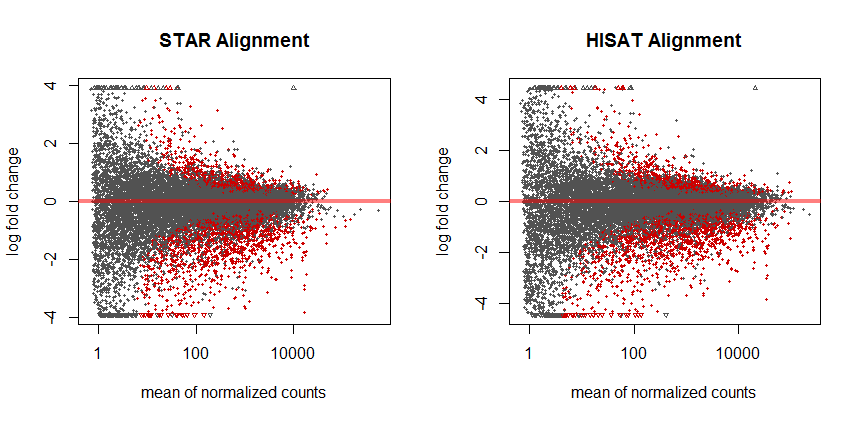

<pre><code>
ntd1 <- normTransform(dds1)
ntd2 <- normTransform(dds2)
vsd1 <- vst(dds1, blind=FALSE)
rld1 <- rlog(dds1, blind=FALSE)
head(assay(vsd1), 3)
vsd2 <- vst(dds2, blind=FALSE)
rld2 <- rlog(dds2, blind=FALSE)
head(assay(vsd2), 3)

msd1 <- meanSdPlot(assay(ntd1))
msd1$gg + ggtitle("STAR Alignment (normal transformation)") + scale_fill_gradient(low = "purple", high = "orange") 
msd2 <- meanSdPlot(assay(ntd2))
msd2$gg + ggtitle("HISAT Alignment (normal transformation)") + scale_fill_gradient(low = "purple", high = "orange") 
</code></pre>

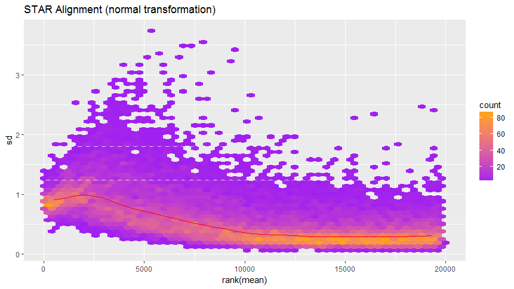 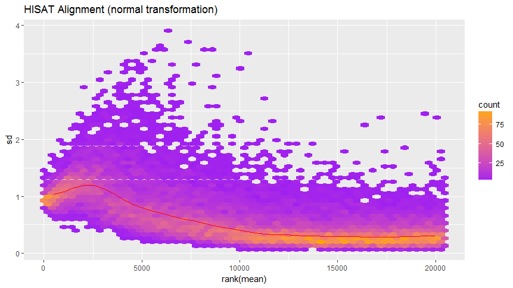 

<pre><code>msd1 <- meanSdPlot(assay(vsd1))
msd1$gg + ggtitle("STAR Alignment (variance stabalize)") + scale_fill_gradient(low = "purple", high = "orange") 
msd2 <- meanSdPlot(assay(vsd2))
msd2$gg + ggtitle("HISAT Alignment (variance stabalize)") + scale_fill_gradient(low = "purple", high = "orange") 
</code></pre>

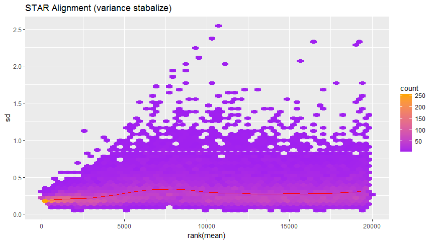 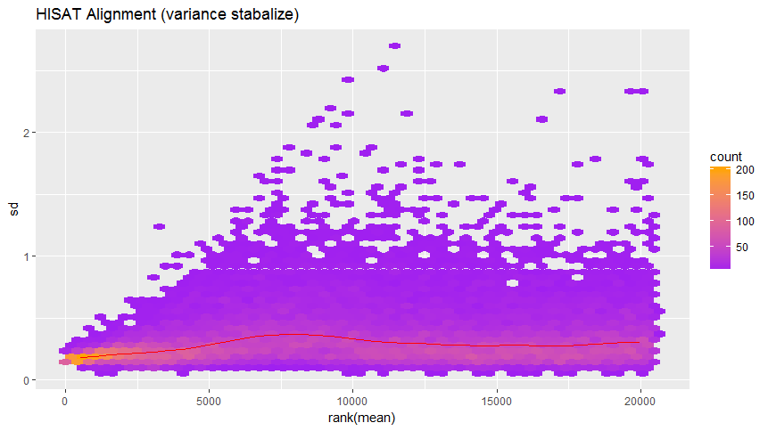 

<pre><code>msd1 <- meanSdPlot(assay(rld1))
msd1$gg + ggtitle("STAR Alignment (regularized log)") + scale_fill_gradient(low = "purple", high = "orange")
msd2 <- meanSdPlot(assay(rld2))
msd2$gg + ggtitle("HISAT Alignment (regularized log)") + scale_fill_gradient(low = "purple", high = "orange")
```
</code></pre>

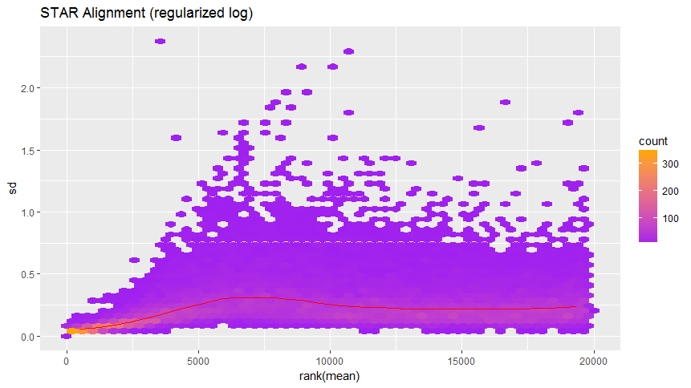 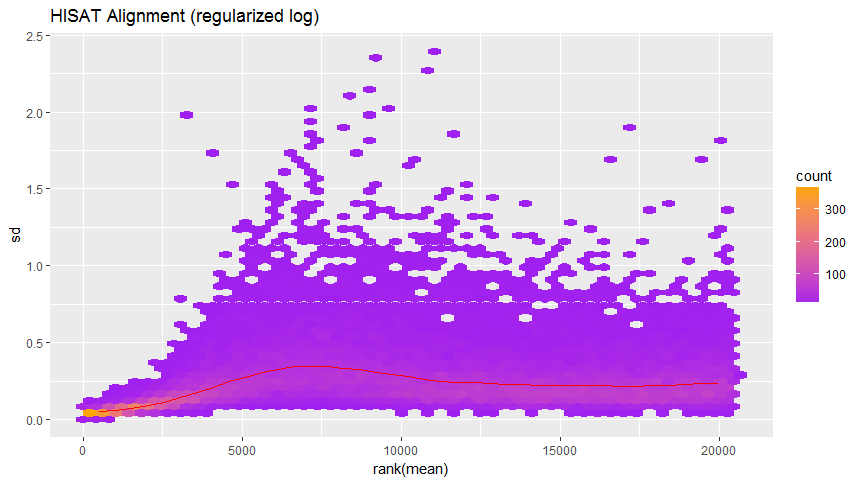 

<pre><code>```{r data_quality_assessment}
select1 <- order(rowMeans(counts(dds1,normalized=TRUE)),
                decreasing=TRUE)[1:20]
df1 <- as.data.frame(colData(dds1)[,c("Strain","Treatment")])
pheatmap(assay(ntd1)[select1,], cluster_rows=FALSE, show_rownames=FALSE,
         cluster_cols=FALSE, annotation_col=df1, main = "STAR Alignment (norm trans)")
pheatmap(assay(vsd1)[select1,], cluster_rows=FALSE, show_rownames=FALSE,
         cluster_cols=FALSE, annotation_col=df1, main = "STAR Alignment (var stab)" )
pheatmap(assay(rld1)[select1,], cluster_rows=FALSE, show_rownames=FALSE,
         cluster_cols=FALSE, annotation_col=df1, main = "STAR Alignment (reg log)")
</code></pre>

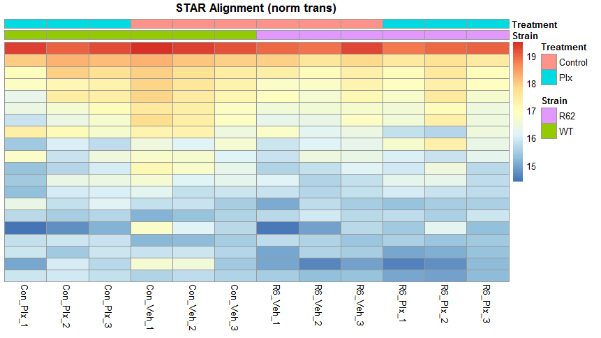   

<pre><code>select2 <- order(rowMeans(counts(dds2,normalized=TRUE)),
                decreasing=TRUE)[1:20]
df2 <- as.data.frame(colData(dds2)[,c("Strain","Treatment")])
pheatmap(assay(ntd2)[select2,], cluster_rows=FALSE, show_rownames=FALSE,
         cluster_cols=FALSE, annotation_col=df2, main = "HISAT Alignment (norm trans)")
pheatmap(assay(vsd2)[select2,], cluster_rows=FALSE, show_rownames=FALSE,
         cluster_cols=FALSE, annotation_col=df2, main = "HISAT Alignment (var stab)" )
pheatmap(assay(rld2)[select2,], cluster_rows=FALSE, show_rownames=FALSE,
         cluster_cols=FALSE, annotation_col=df2, main = "HISAT Alignment (reg log)")
```
</code></pre>

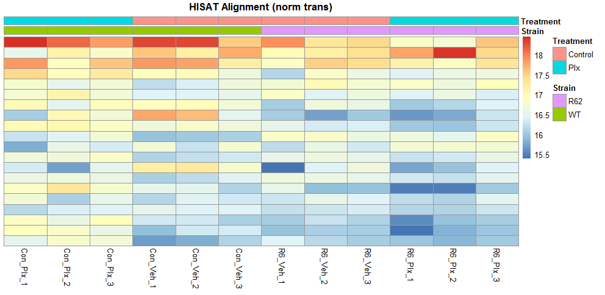   

<pre><code>```{r sample-t-sample_distances}
sampleDists1 <- dist(t(assay(vsd1)))
sampleDistMatrix1 <- as.matrix(sampleDists1)
rownames(sampleDistMatrix1) <- paste(vsd1$Strain, vsd1$Treatment, sep="-")
colnames(sampleDistMatrix1) <- NULL
colors <- colorRampPalette( rev(brewer.pal(9, "Blues")) )(255)
pheatmap(sampleDistMatrix1,
         clustering_distance_rows=sampleDists1,
         clustering_distance_cols=sampleDists1,
         col=colors, main = "STAR Alignment")
plotPCA(vsd1, intgroup=c("Strain", "Treatment")) + ggtitle("STAR Alignment")
pcaData1 <- plotPCA(vsd1, intgroup=c("Strain", "Treatment"), returnData=TRUE)
</code></pre>

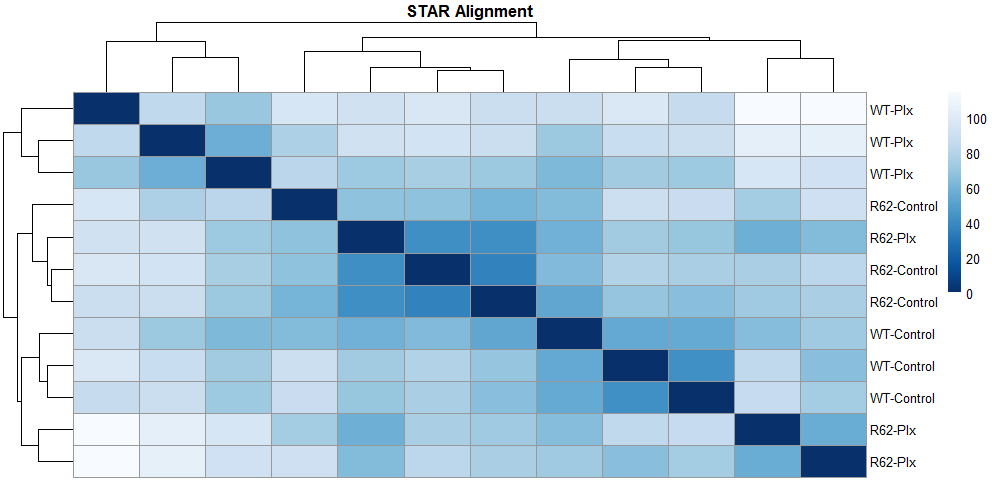 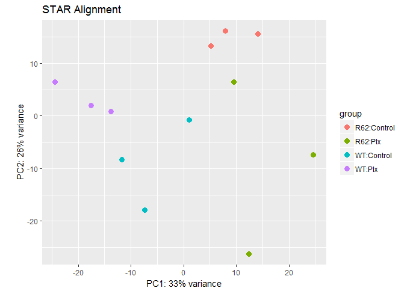 

<pre><code>sampleDists2 <- dist(t(assay(vsd2)))
sampleDistMatrix2 <- as.matrix(sampleDists2)
rownames(sampleDistMatrix2) <- paste(vsd2$Strain, vsd2$Treatment, sep="-")
colnames(sampleDistMatrix2) <- NULL
colors <- colorRampPalette( rev(brewer.pal(9, "Blues")) )(255)
pheatmap(sampleDistMatrix2,
         clustering_distance_rows=sampleDists2,
         clustering_distance_cols=sampleDists2,
         col=colors, main = "HISAT Alignment")
plotPCA(vsd2, intgroup=c("Strain", "Treatment")) + ggtitle("HISAT Alignment")
</code></pre>

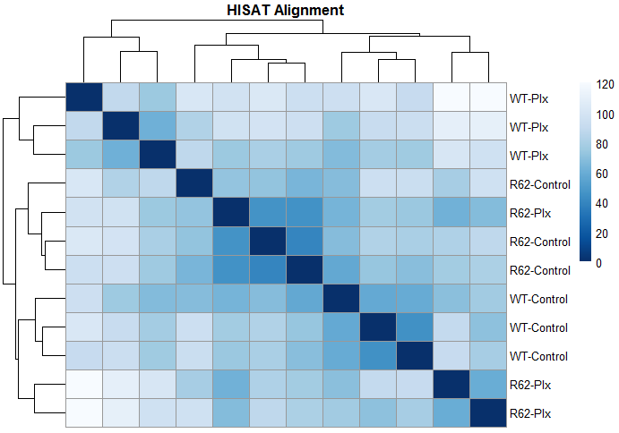 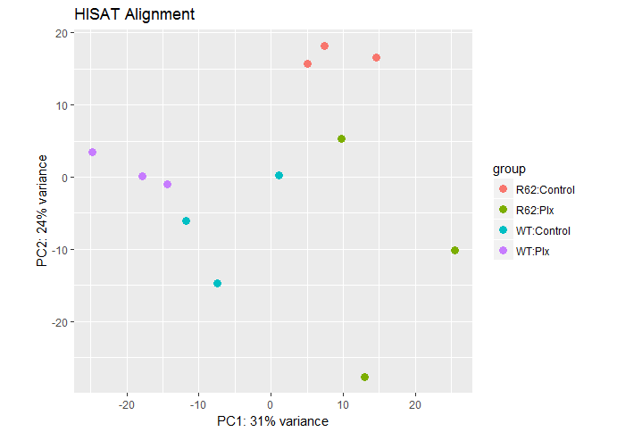 

## Explaination

Seeing as I trimmed more in the STAR pipeline, the difference in gene number could attest to that. This would also cause a small difference in the variance seen in the PCA plot. However, the genes didn't change significantly, so I assume both STAR and HISAT had a similar algorithm for alignment.
